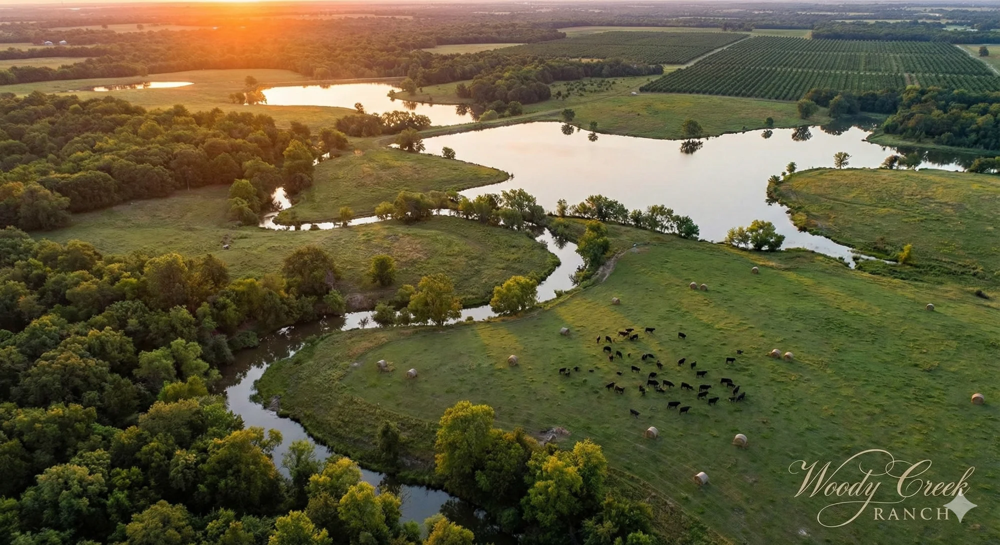

# Woody Creek Ranch

A luxury real estate website for a 1,500-acre estate development in Collin County, Texas.



## Features

- 🎬 **Video Hero** - Cinematic flyover video with image fallback
- 💬 **AI Concierge** - Chat widget powered by Claude for property questions
- 🖼️ **Image Gallery** - Interactive feature cards with hover effects
- 📱 **Responsive** - Fully mobile-optimized design
- ⚡ **Fast** - Built with Vite + React

## Quick Start

```bash
npm install
npm run dev
```

Open [http://localhost:5173](http://localhost:5173)

## Deploy to Vercel

1. Push to GitHub
2. Import project at [vercel.com](https://vercel.com)
3. Add environment variable: `ANTHROPIC_API_KEY`
4. Deploy!

See [CLAUDE.md](./CLAUDE.md) for detailed instructions.

## Tech Stack

- React 19
- Vite
- Tailwind CSS
- Vercel Serverless Functions
- Claude API (Anthropic)
